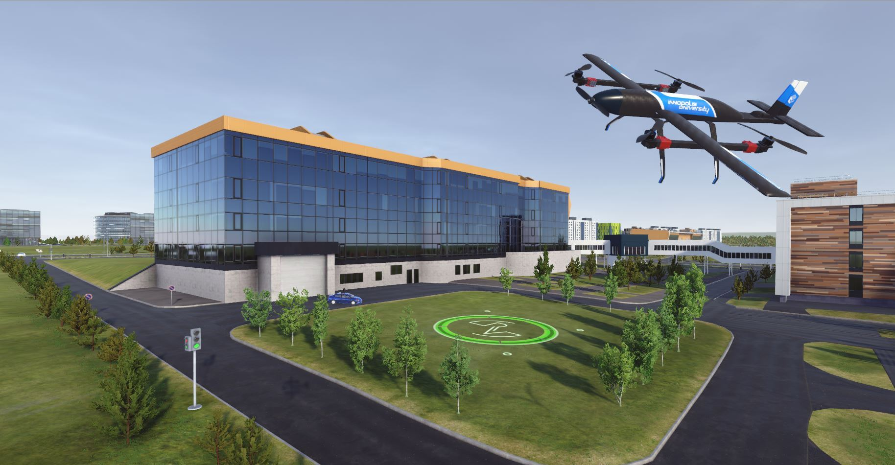

# Innopolis Simulator UAV Interface



## Innopolis Simulator UAV API
Innopolis Simulator currently supports following API to control pose and actuators state of Innopolis VTOL UAV:

### To Simulator

ROS --> Sim

#### GPS Position
Topic name is `/sim/gps_position`.
Topic type is `sensor_msgs/NavSatFix`.

#### Orientation
Topic name is `/sim/attitude`.
Topic type is `geometry_msgs/QuaternionStamped`.

#### Actuators State
Topic name is `/sim/actuators`.
Topic type is `sensor_msgs/Joy`.

Axes in Joy message have following meaning:

1. FR, cw, rate, rpm (Front right motor speed)
2. RL, cw, rate, rpm (Rear left motor speed)
3. FL, ccw, rate, rpm (Front left motor speed)
4. RR, ccw, rate, rpm (Rear right motor speed)
5. aileron left, cw, deg
6. aileron right, cw, deg
7. elevator, cw, deg
8. rudder, cw, deg
9. thrust, pusher, rate, rpm

#### Gimbal
Topic name is `/sim/gimbal_angle`.
Topic type is `geometry_msgs/Vector3Stamped`.


### From Simulator

Sim --> ROS

#### Camera

TODO

#### LIDAR

Topic name is /sim/velodyne_points.
Topic type is sensor_msgs/PointCloud2.

## Installation
Install PX4 and ROS according to [manual](https://dev.px4.io/master/en/setup/dev_env_linux_ubuntu.html) (`ubuntu_sim_ros_melodic.sh` bash script usage is recommended).

Install `rosbridge` from LGSVL:

```
roscd
cd ../src
git clone https://github.com/lgsvl/rosbridge_suite.git
catkin build
sudo apt-get install ros-melodic-rosauth
sudo apt-get install python-bson
sudo apt-get install python-protobuf
```


## Launch with Gazebo (PX4 SITL)

Run all:

```
roscd inno_sim_interface/scripts
scripts/run_all.sh
```

Kill:

`tmux kill-session -t innosim`

